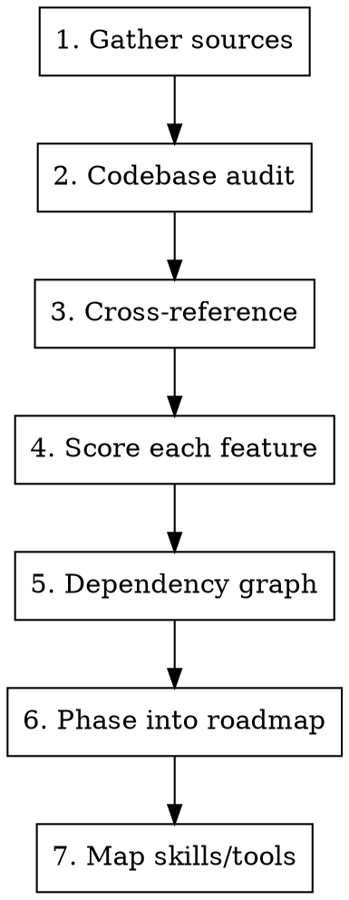

# Product Gap Analysis

## Overview

Transform external research (videos, threads, articles, competitor reviews) into a structured, prioritized feature backlog with implementation cost estimates. The output is an actionable roadmap document, not a vague list of ideas.

## When to Use

- Founder shares YouTube/Reddit/article insights and wants actionable features
- Competitive analysis needs translating into backlog items
- Pre-launch product audit against best practices
- User feedback needs organizing into implementation plan
- Any "improve my product" request with external input

## Core Process



### Step 1: Gather and Tag Sources

Tag every insight with its origin. This prevents losing context and enables filtering.

| Tag | Source Type | Example |
|-----|-----------|---------|
| CODEBASE | Gap found in code review | Missing error tracking |
| YOUTUBE | Video strategy/tactic | Email onboarding sequences |
| REDDIT | Community thread insight | Programmatic SEO pages |
| ARTICLE | Blog/documentation | AI crawler optimization |
| COMPETITOR | Competitive analysis | Feature X that rival has |
| USER | Direct user feedback | "I wish I could export" |
| HYBRID | Multiple sources agree | Confirmed from 2+ sources |

### Step 2: Codebase Audit

Before proposing features, check what already exists. Classify each feature:

| Status | Meaning | Action |
|--------|---------|--------|
| **NOVO** | Completely new, nothing exists | Full implementation |
| **PARCIAL** | Foundation exists, needs expanding | Build on existing code |
| **GAP** | Should exist but doesn't | Priority fix |

**Critical:** Search the codebase for existing implementations. A "new" feature that already has partial support wastes effort if rebuilt from scratch.

### Step 3: Cross-Reference Sources with Codebase

For each insight from sources, answer:
- Does this already exist? (skip or mark DONE)
- Is there partial support? (mark PARCIAL, scope the delta)
- Is this completely missing? (mark NOVO or GAP)
- Does this contradict another source? (flag for user decision)
- Is this relevant to the product's stage? (pre-launch vs growth vs scale)

### Step 4: Score with ACR

**REQUIRED:** Use the `estimating-agent-tasks` skill for ACR scoring.

Every feature gets an ACR score (E + R + I = 3-15) with:

| Field | What to Estimate |
|-------|-----------------|
| E (Scope) | Files touched (1-5) |
| R (Review) | Human review time (1-5) |
| I (Iteration) | Round-trips to get right (1-5) |
| ACR | Sum (3-15) |
| Size | XS/S/M/L/XL |
| Model | Haiku/Sonnet/Opus |
| Tokens ~ | Estimated token usage |
| Cost ~ | Estimated $ cost |
| Time ~ | Wall-clock estimate |

### Step 5: Dependency Graph

Identify which features block others:
- `A → B` means B depends on A (implement A first)
- Independent features can run in parallel
- Calculate **critical path** (longest sequential chain)
- Calculate **parallel time** (with max parallelism)

### Step 6: Phase into Roadmap

Group features into phases by strategic priority:

| Phase | Purpose | Criteria |
|-------|---------|----------|
| Foundation | Must-have before launch | Blocks other features or users |
| Growth | Acquisition & conversion | SEO, analytics, onboarding |
| Retention | Reduce churn | Email sequences, notifications, trial UX |
| Scale | Future needs | i18n, multi-tenant, advanced features |

Within each phase:
- Order by dependency (blockers first)
- Identify parallel opportunities
- Estimate phase timeline (critical path, not sum)

### Step 7: Map Available Skills/Tools

For each feature, list which skills or tools can help implementation:
- Existing Claude Code skills (check available skills list)
- Libraries/SDKs that solve the problem
- External services (free tier first)

Features with no applicable skills need more iteration cycles (higher I score).

## Output Template

The document should contain these sections in order:

1. **Header** — Project name, date, sources, objective, metric (ACR)
2. **Skills mapping** — Table of features → applicable skills
3. **Legend** — Source tags and status definitions
4. **Executive Summary** — Category totals table with ACR/tokens/cost/status
5. **Feature Details** — Per feature: origin, status, problem, solution, ACR table, dependencies, acceptance criteria
6. **Consolidated Table** — All features sorted by Master Plan score
7. **Phased Roadmap** — Phases with dependency/parallelism analysis
8. **Cross-reference** — Features already in backlog (avoid duplication)

### Per-Feature Template

```markdown
### X.Y `feature-slug` — Feature Title

**Origin**: SOURCE_TAG | **Status**: NOVO/PARCIAL/GAP

**Problem**: Why this matters (1-2 sentences)

**Solution**: What to build (bullet points)

**ACR**:
| E | R | I | ACR | Size | Model | Tokens ~ | Cost ~ | Time ~ |
|---|---|---|-----|------|-------|----------|--------|--------|

**Dependencies**: What must exist first
**Acceptance Criteria**:
- [ ] Concrete, testable criteria
```

## Common Mistakes

| Mistake | Fix |
|---------|-----|
| Vague priority ("High/Medium/Low") | Use ACR numeric scoring |
| Flat list without dependencies | Draw dependency graph, calculate critical path |
| Proposing features that already exist | Audit codebase FIRST, classify as NOVO/PARCIAL/GAP |
| No cost estimation | ACR includes tokens, cost, and time estimates |
| Ignoring product stage | Filter features by stage (pre-launch vs growth) |
| No acceptance criteria | Every feature needs testable "done" definition |
| Missing source attribution | Tag every feature with its origin source |
| No parallelism analysis | Calculate critical path vs parallel execution time |
| Rebuilding from scratch when partial exists | Check codebase for existing foundation |
