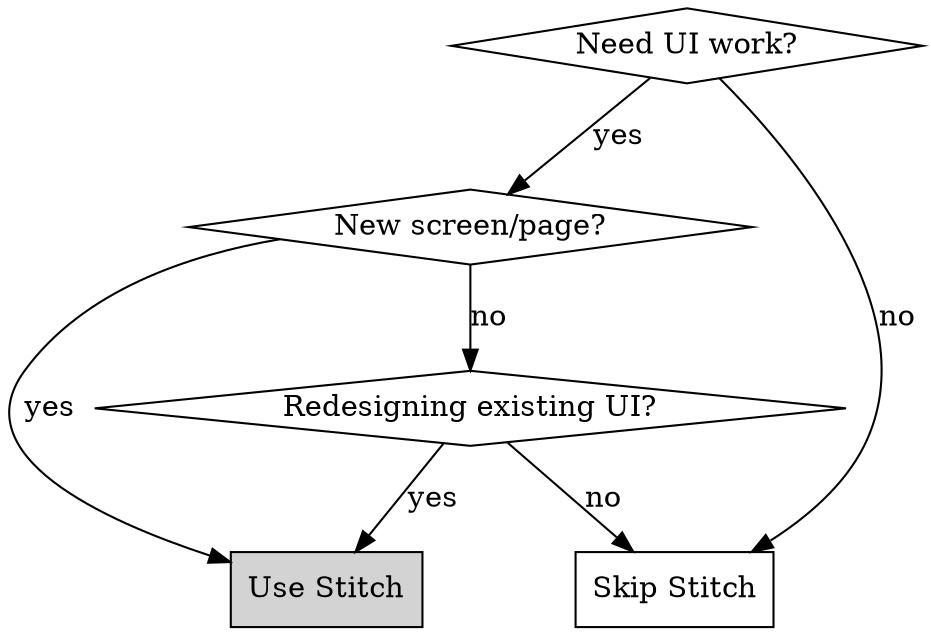

# Using Google Stitch MCP

## Overview

Stitch MCP brings AI-powered UI design directly into your coding workflow. Generate designs from prompts, download production-ready HTML/Tailwind code, and convert to React components—all without leaving your IDE.

## When to Use



**Use Stitch for:**
- Creating new screens or pages
- Redesigning existing UI
- Rapid prototyping and ideation
- Getting past "blank page" syndrome
- Generating consistent design systems

**Don't use for:**
- Minor text/style tweaks (just edit code directly)
- Backend-only changes
- Bug fixes in existing components

## Core Workflow

### 1. List Your Projects

```
Show me my Stitch projects.
List each screen under each project with its screen id.
```

### 2. Download Design Code

```
Download the HTML code for the [Screen Name] screen in the [Project Name] project.
Use curl -L to download.
Create a file named ./tmp/[screen-name].html with the HTML code.
```

### 3. Download Design Image

```
Download the image for the [Screen Name] screen in the [Project Name] project.
Use curl -L to download.
Create a file named ./tmp/[screen-name].png with the image.
```

### 4. Convert to React Components

The HTML serves as a translation base. Convert to project's component structure:

```
Convert this HTML to React components following our project patterns:
- Use shadcn/ui components where applicable
- Follow Next.js App Router conventions
- Keep Tailwind classes, adapt to our theme
- Split into logical component files
```

## Effective Prompting

### Initial Prompt Formula

| Element | Purpose | Example |
|---------|---------|---------|
| **Idea** | What it is | "A booking confirmation screen" |
| **Theme** | Visual style | "Modern, clean, uses brand colors" |
| **Content** | Specific elements | "Show date, time, professional name, service details" |
| **Image** | Reference (optional) | Upload existing screen as reference |

### Example Prompt

```
Idea: A booking confirmation screen for a service appointment app.
Theme: Modern, clean, light mode with subtle shadows.
Content:
- Success checkmark animation
- Appointment date/time prominently displayed
- Professional's name and photo
- Service name and duration
- "Add to Calendar" and "View Details" buttons
- Option to cancel or reschedule
```

### Iteration Formula

Target one change at a time. Be specific:

```
Update the [specific element] on the [screen name].
[Specific visual instruction].
[UI/UX keyword for clarity].
```

**Good:** "Update the CTA button to be larger with more padding. Add a subtle shadow for depth."

**Bad:** "Make it look better."

## Design Modes

| Mode | Best For |
|------|----------|
| **Thinking with 3 Pro** | Complex logic, production candidates |
| **Redesign (Nano Banana)** | Modernizing old UIs, vibe-based workflows |
| **2.5 Pro** | High-fidelity HTML, A/B comparisons |
| **Fast** | Rapid wireframing, Figma exports |

## Style Keywords Reference

### Layout
- Bento Grid, Editorial, Swiss Style, Split-Screen

### Texture
- Glassmorphism, Claymorphism, Skeuomorphic, Grainy/Noise

### Atmosphere
- Brutalist, Cyberpunk, Y2K, Retro-Futurism

### Color
- Duotone, Monochromatic, Pastel Goth, Dark Mode OLED

## Project Integration (Next.js + shadcn)

When converting Stitch HTML to this project:

1. **Component Location:** `frontend/src/components/[feature]/`
2. **Page Location:** `frontend/src/app/[route]/page.tsx`
3. **Replace HTML elements with shadcn:**
   - `<button>` → `<Button>` from `@/components/ui/button`
   - `<input>` → `<Input>` from `@/components/ui/input`
   - Cards, dialogs, etc. → Use Radix-based shadcn components
4. **Keep Tailwind classes** but verify against `tailwind.config.ts`
5. **Add TypeScript types** for all props
6. **Use React Query** for data fetching patterns

## Common Mistakes

| Mistake | Fix |
|---------|-----|
| Trying to perfect first prompt | Iterate! Get past blank page, then refine. |
| Changing too many things at once | One major change per prompt. |
| Generic prompts ("make it nice") | Use specific UI/UX keywords and targets. |
| Forgetting to download both code AND image | Always get both for reference during conversion. |
| Not using project component library | Map HTML to shadcn/ui equivalents. |

## Quick Commands

```bash
# List projects
"Show my Stitch projects with all screens and IDs"

# Get code
"Download HTML for [Screen] in [Project] to ./tmp/"

# Get image
"Download image for [Screen] in [Project] to ./tmp/"

# Convert
"Convert ./tmp/[screen].html to React components using shadcn/ui"
```
