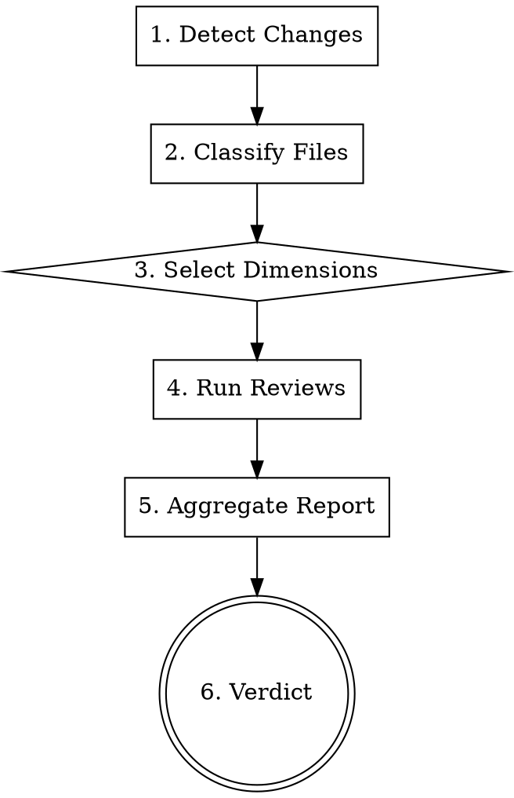

# Quality Gate

## Overview

Comprehensive validation of all work done in a session/batch. Detects what changed and applies conditional review dimensions.

**Core principle:** One command to validate everything. No dimension skipped, no issue missed.

## When to Use

- After completing a batch of tasks
- Before committing or creating PRs
- After implementing a feature end-to-end
- When finishing a development branch

**Complements (not replaces):**
- `superpowers:verification-before-completion` (run tests/build first)
- `superpowers:requesting-code-review` (architecture-focused review)

## The Process



### Step 1: Detect Changes

```bash
# Get all changed files in this batch
git diff --name-only {BASE_SHA}..HEAD
# Or for uncommitted work:
git diff --name-only HEAD && git diff --name-only --cached
```

### Step 2: Classify & Select Dimensions

Based on changed files, select which dimensions apply:

| File Pattern | Dimensions Applied |
|---|---|
| `frontend/**/*.tsx`, `frontend/**/*.ts` | Code Quality, Security, Performance (Frontend), UI/UX, Accessibility, Design System |
| `frontend/**/*.css`, `frontend/**/*.module.css` | Design System, Accessibility, UI/UX |
| `src/**/*.ts` (backend) | Code Quality, Security (OWASP), Performance (Backend/Lambda) |
| `src/routes/**`, `src/controllers/**` | API Design, Rate Limiting, Auth checks |
| `prisma/**`, `**/migration*` | Data Safety, Migration Reversibility |
| `package.json`, `package-lock.json` | Licensing, Dependency Audit |
| `infra/**`, `sst.config.ts`, `.github/**` | Infrastructure Security, Secrets Exposure |
| `shared/**` | Cross-cutting (both frontend + backend dimensions) |

**ALWAYS applied (regardless of files):**
- Code Quality (logic, patterns, DRY)
- Security (secrets, injection, auth)

### Step 3: Run Applicable Dimensions

Dispatch the quality-gate-reviewer subagent (see template) with the detected dimensions.

**How to dispatch:**

```
Use Task tool with subagent_type: "superpowers:code-reviewer"
Fill template from: quality-gate/quality-gate-reviewer.md
Pass: {CHANGED_FILES}, {DIMENSIONS}, {BASE_SHA}, {HEAD_SHA}
```

### Step 4: Act on Results

| Severity | Action |
|----------|--------|
| **Blocker** | Fix immediately. Cannot proceed. |
| **Critical** | Fix before commit/merge. |
| **Warning** | Fix if quick (<5 min), otherwise document as known issue. |
| **Info** | Note for future improvement. No action required. |

## Review Dimensions Reference

### 1. Code Quality (ALWAYS)
- Logic errors, edge cases, off-by-one
- Error handling completeness
- Type safety (no `any`, no unsafe casts)
- DRY violations (duplicated logic)
- Naming clarity and consistency
- Separation of concerns

### 2. Security - OWASP (ALWAYS)
- **Injection**: SQL, NoSQL, OS command, template injection
- **XSS**: Unescaped user input in HTML/JSX
- **Auth bypass**: Missing auth checks on protected routes
- **Secrets**: Hardcoded API keys, tokens, passwords
- **CSRF**: Missing CSRF protection on state-changing endpoints
- **Mass assignment**: Accepting unvalidated fields from request body
- **Rate limiting**: Missing on public/sensitive endpoints
- **LGPD/Privacy**: PII exposure in logs, responses, errors

### 3. Performance - Frontend (conditional)
- Bundle size impact (new imports, large libraries)
- Unnecessary re-renders (missing memo, unstable references)
- Data fetching waterfalls (sequential when parallel possible)
- Image optimization (raw `` vs `next/image`)
- Missing lazy loading for below-fold content
- Client-side computation that belongs server-side

### 4. Performance - Backend/Lambda (conditional)
- N+1 database queries
- Missing database indexes for new query patterns
- Cold start impact (heavy imports at top level)
- Connection pool misuse
- Blocking synchronous operations
- Lambda timeout risk (long-running operations)

### 5. UI/UX (conditional: frontend changes)
- Error states: clear, actionable messages
- Loading states: skeleton/spinner present
- Empty states: helpful guidance shown
- Form validation: inline, immediate feedback
- Mobile responsiveness: touch targets >= 44px
- Progressive disclosure: information in logical order
- User feedback: actions confirmed visually

### 6. Accessibility (conditional: frontend changes)
- Semantic HTML (button vs div, nav vs div)
- ARIA labels on interactive elements
- Keyboard navigation support
- Focus management (modals, drawers)
- Color contrast (WCAG AA minimum)
- Screen reader compatibility
- Form labels associated with inputs

### 7. Design System (conditional: frontend changes)
- Using project components (Button, Modal, Switch, Container)
- Consistent spacing (Tailwind scale)
- Typography hierarchy respected
- Color palette adherence (no hardcoded hex)
- Consistent border-radius, shadows
- Dark mode compatibility (if applicable)

### 8. API Design (conditional: routes/controllers)
- RESTful conventions followed
- Consistent error response format
- Pagination on list endpoints
- Input validation via Zod schemas
- Response types match OpenAPI/docs
- Versioning consistency

### 9. Data Safety (conditional: schema/migrations)
- Migration is reversible
- No data loss on rollback
- Zero-downtime compatibility
- Index strategy appropriate
- Foreign key constraints correct
- Default values safe

### 10. Licensing (conditional: dependency changes)
- No GPL/AGPL in proprietary project
- New dependencies are MIT/Apache/BSD/ISC
- No unnecessary new dependencies
- Package is actively maintained

## Quick Reference: Conditional Matrix

```
Changed files → Detect automatically with git diff

Frontend (.tsx/.ts/.css in frontend/):
  ✅ Code Quality
  ✅ Security (XSS, secrets)
  ✅ Performance (Frontend)
  ✅ UI/UX
  ✅ Accessibility
  ✅ Design System

Backend (.ts in src/):
  ✅ Code Quality
  ✅ Security (OWASP full)
  ✅ Performance (Backend/Lambda)
  ✅ API Design (if routes/controllers)

Schema (prisma/, migrations):
  ✅ Code Quality
  ✅ Data Safety

Dependencies (package.json):
  ✅ Licensing
  ✅ Security (dependency audit)

Infrastructure (infra/, .github/, sst.config.ts):
  ✅ Security (secrets, IAM)
  ✅ Infrastructure review
```

## Common Mistakes

| Mistake | Fix |
|---------|-----|
| Running all dimensions on backend-only change | Use conditional matrix - skip UI/UX/DS |
| Reporting theoretical risks | Only report REAL vulnerabilities with exploit path |
| Flagging style opinions as Critical | Style = Info. Bugs/security = Critical |
| Skipping licensing check on new deps | Always check when package.json changes |
| Not checking rate limiting on new endpoints | Every public endpoint needs rate limiting |
| Missing empty/error/loading state check | Every UI component needs all 3 states |

## Integration with Other Skills

**Before quality-gate:**
1. `superpowers:verification-before-completion` - Run tests, build, linter FIRST
2. Only then run quality-gate for deeper analysis

**After quality-gate:**
1. Fix Blocker/Critical issues
2. `superpowers:finishing-a-development-branch` - Merge/PR decision

**In executing-plans workflow:**
- Run quality-gate after each batch (3 tasks)
- Lighter than full code-review, broader than verification

## Example Usage

```
[Completed 3 tasks: bulk approve/decline API + frontend hooks + UI components]

1. Run verification-before-completion (tests pass, build clean)
2. Detect changes:
   git diff --name-only origin/main..HEAD
   → src/controllers/appointment.controller.ts  (backend)
   → src/routes/appointment.routes.ts           (backend)
   → src/use-cases/appointment/bulk-*.ts        (backend)
   → frontend/src/features/appointments/*.ts    (frontend)
   → frontend/src/features/appointments/*.tsx   (frontend)

3. Selected dimensions:
   Backend: Code Quality, Security, Performance, API Design
   Frontend: Code Quality, Security, UI/UX, Accessibility, Design System, Performance

4. Dispatch quality-gate-reviewer subagent with dimensions

5. Report:
   Blocker: 0
   Critical: 1 (missing rate limit on bulk endpoint)
   Warning: 2 (no loading state on bulk action, missing aria-label)
   Info: 1 (could memoize filtered list)

6. Fix critical → re-verify → proceed to commit
```
